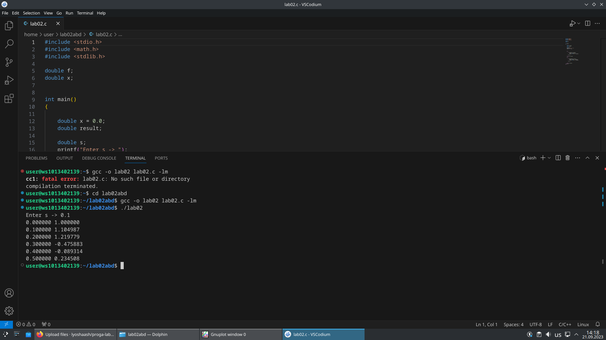
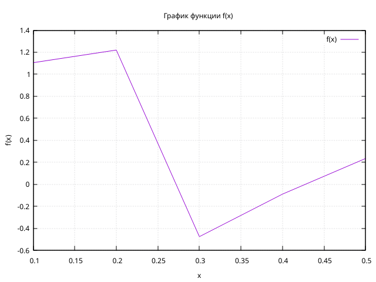
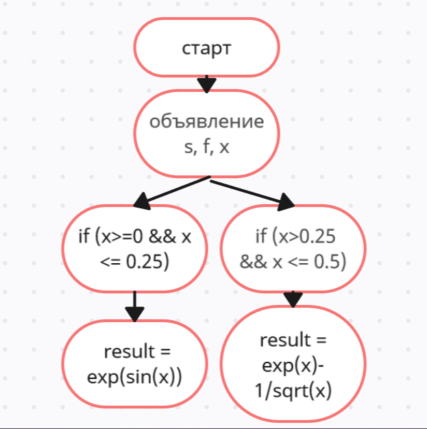
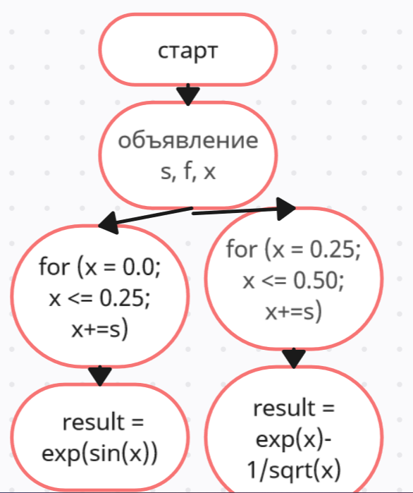

# lab02

## Задание

1. Напишите программу по варианту, используя оператор цикла while (нечётные варианты) или do while (чётные варианты).
2. Напишите программу, используя оператор цикла for.
3. Постройте график с использованием gnuplot.
4. Составьте блок-схемы.
5. формите отчёт в README.md. Отчёт должен содержать:
   - Задание
   - Описание проделанной работы
   - Скриншоты результатов
   - Блок-схемы
   - График функции
   - Ссылки на используемые материалы

## Проделанная работа

Создал первую программу используя цикл `do while` (2 вариант)  
Создал такую же программу, но используя цикл `for`  
Построил график, используя `gnuplot`  
Составил блок-схемы  

## Скриншоты

## Список использованных источников

1. [лаба](https://evil-teacher.on.fleek.co/prog_pm/lab02/)

2. [сайт для блок схем](https://creately.com/ru/lp/%D0%9F%D1%80%D0%BE%D0%B3%D1%80%D0%B0%D0%BC%D0%BC%D0%B0-%D0%B1%D0%BB%D0%BE%D0%BA-%D1%81%D1%85%D0%B5%D0%BC-%D0%BE%D0%BD%D0%BB%D0%B0%D0%B9%D0%BD/)

