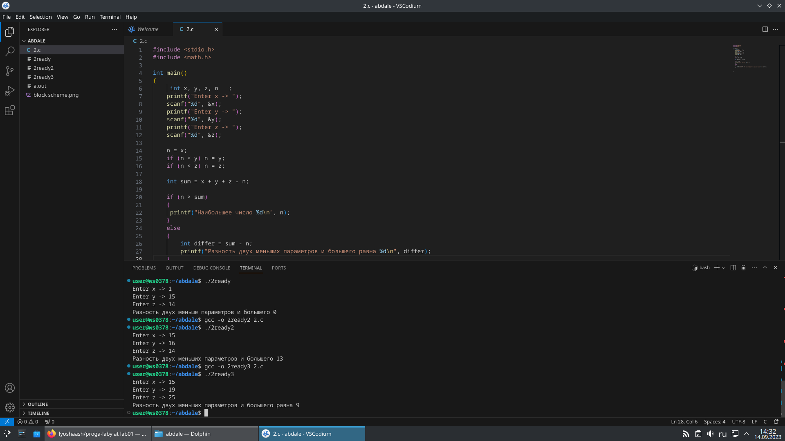
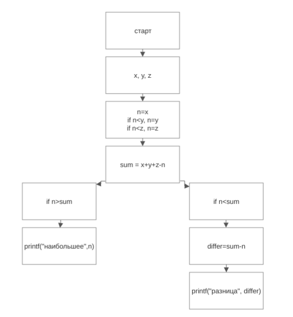
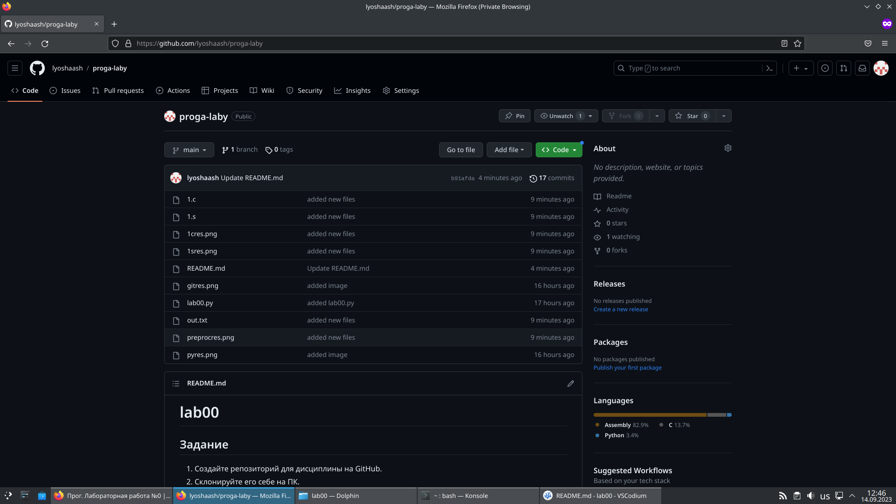
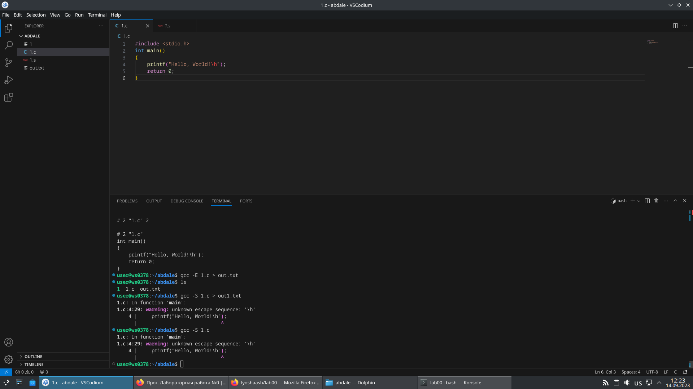
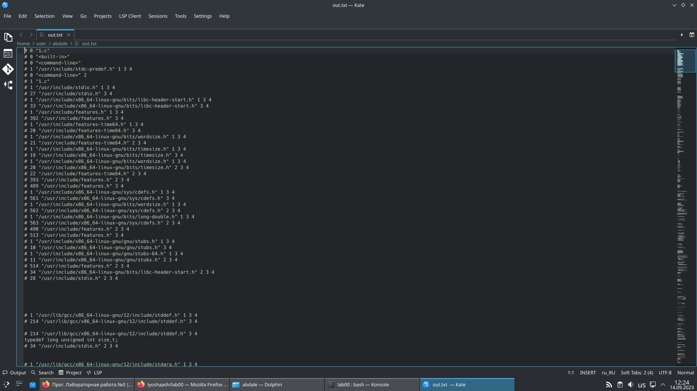
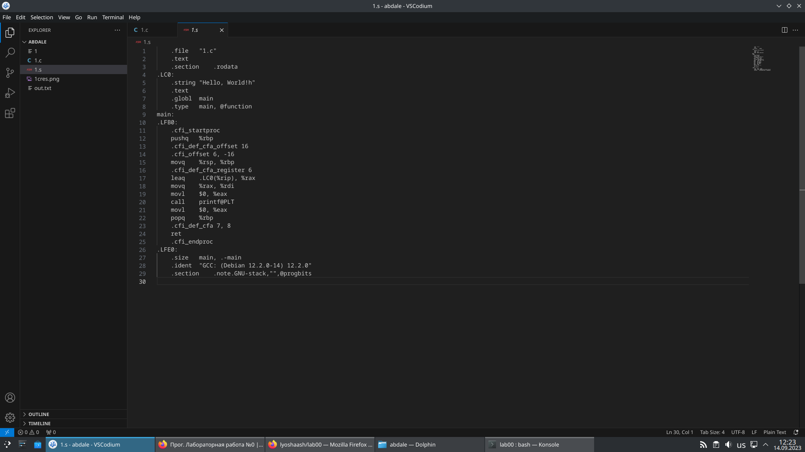

# lab01 

## Задание

  1. Разберите код программы из примера.
  2. Составьте блок-схему алгоритма для своего варианта.
  3. Напишите программу, решающую задачу по своему варианту.
  4. Оформите отчёт в README.md. Отчёт должен содержать:
      - Задание
      - Описание проделанной работы
      - Скриншоты результатов
      - Блок-схему
      - Ссылки на используемые материалы

## Проделанная работа
  Сперва состаил блок схему своего задания (`вариант 2`)  
  Затем решил задание на языке C (`2.c`)  

## Скриншоты

## Список использованных источников

[сайт где делал схему](https://www.smartdraw.com/block-diagram/block-diagram-maker.htm)

[сама лаба](https://evil-teacher.on.fleek.co/prog_pm/lab01/)

# lab00

## Задание

  1.  Создайте репозиторий для дисциплины на GitHub.
  2. Склонируйте его себе на ПК.
  3.  Напишите свою первую программу.
  4. Скомпилируйте и запустите её.
  5.  Получите по отдельности результаты каждого этапа компиляции.
  6.  Напишите отчёт в README.md. Отчёт должен содержать:
       - Задание
       - Описание проделанной работы
       - Консольные команды
       - Скриншоты результатов
       - Ссылки на используемые материалы
  7.  Сделайте коммит и пуш.
  8.  Добавьте для себя в отчёт шпаргалку по работе с git.

## Проделанная работа

После создания проекта на GitHub'е, склонировал его в Git Bash используя `git clone`.  
Затем, создал файл `1.c` и добавил в Git с помощью `git add`.  
После написал простейшую прогу в том же `1.c`, запрепроцессил, используя `gcc -E 1.c` (`out.txt`), перевел в ассемблер с помощью `gcc -S 1.c` (`1.s`) и закоммитил файл используя `git commit -m "text"`.  
В конце концов заупшил все используя `git push`.  

## Скриншоты

## Список использованных источников

1. [CS50W - Lecture 1 - Git](https://www.youtube.com/watch?v=NcoBAfJ6l2Q)
2. [report_demo](https://github.com/still-coding/report_demo)
3. [Язык разметки Markdown](https://doka.guide/tools/markdown/)
4. [сама лаба](https://evil-teacher.on.fleek.co/prog_pm/lab00/)
