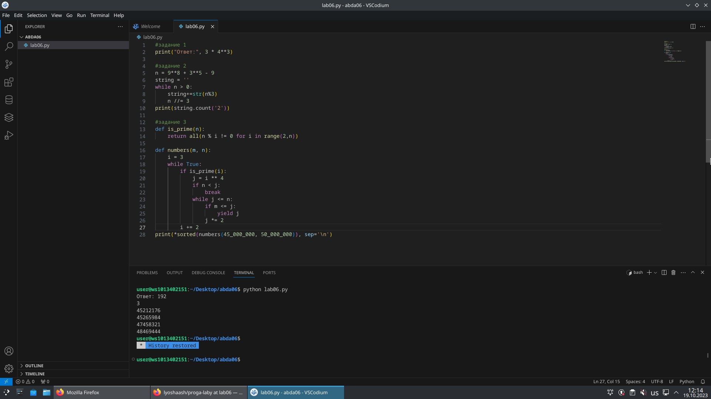

# lab06

## Задание

  1. Напишите программу для решения задач своего варианта.
  2. Оформите отчёт в README.md. Отчёт должен содержать:
     - Условия задач
     - Описание проделанной работы
     - Скриншоты результатов
     - Ссылки на используемые материалы
## Проделанная работа
  Прорешал все задания из своего варианта (`2`)

## Скриншоты

## Список использованных источников

[сама лаба](https://evil-teacher.on.fleek.co/prog_pm/lab06/)
