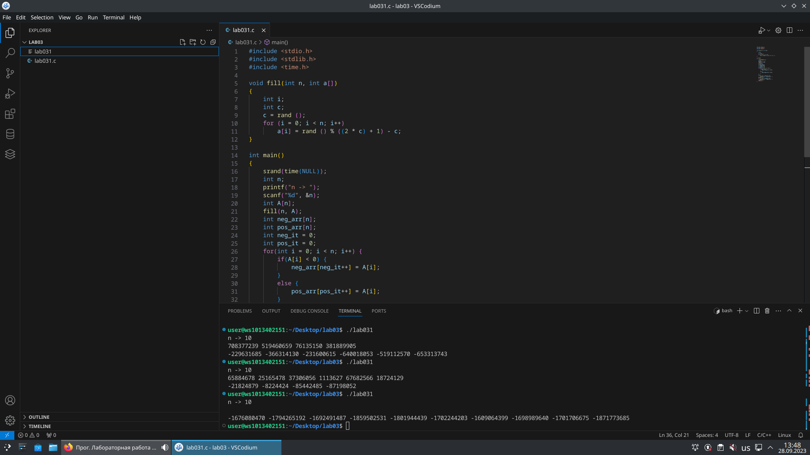

# lab03

## Задание

1. Напишите программу по своему варианту.
2. Оформите отчёт в README.md. Отчёт должен содержать:
    - Задание
    - Описание проделанной работы
    - Скриншоты результатов
    - Ссылки на используемые материалы

## Проделанная работа

Написал программу по своему варианту (`2`)
  - Сначала создал генератор случайных чисел
  - Затем распределял числа в разные массивы, в зависимости от их знака

## Скриншоты 

## Список использованных источников

1. [лаба](https://evil-teacher.on.fleek.co/prog_pm/lab03/)
