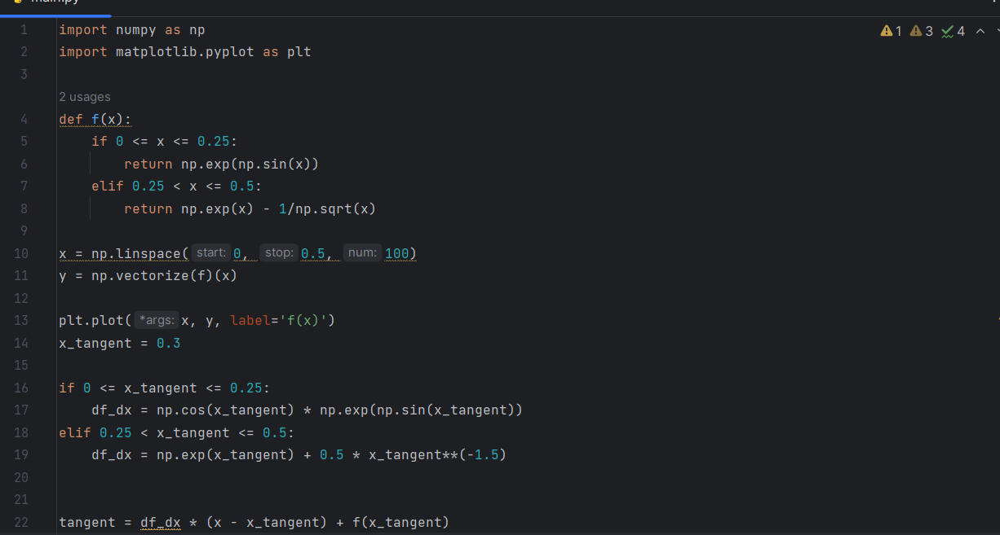
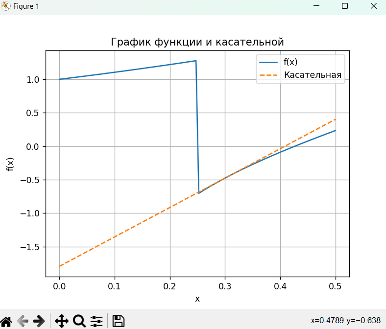

# lab05

## Задание
   
  1.  Создайте в каталоге для данной ЛР в своём репозитории виртуальное окружение и установите в него matplotlib и numpy. Создайте файл requirements.txt.
  2.  Откройте книгу [1] и выполните уроки 1-3. Первый урок можно начинать со стр. 8.
  3.  Выберите одну из неразрывных функции своего варианта из лабораторной работы №2, постройте график этой функции и касательную к ней. Добавьте на график заголовок, подписи осей, легенду, сетку, а также аннотацию к точке касания.
  4.  Добавьте в корень своего репозитория файл .gitignore отсюда, перед тем как делать очередной коммит.
  5.  Оформите отчёт в README.md. Отчёт должен содержать:
    -графики, построенные во время выполнения уроков из книги
    -объяснения процесса решения и график по заданию 4
  6. Склонируйте этот репозиторий НЕ в ваш репозиторий, а рядом. Изучите использование этого инструмента и создайте pdf-версию своего отчёта из README.md. Добавьте её в репозиторий.

## Проделанная работа
  Сначала выполнил уроки по книге, после чего приступил к выполнению задания: написанию функции своего варианта (`2`) на питоне и составлению ее графика.

## Скриншоты

## Список использованных источников

[книга](https://evil-teacher.on.fleek.co/books/prog_pm/matplotlib.pdf)

[сама лаба](https://evil-teacher.on.fleek.co/prog_pm/lab05/)

