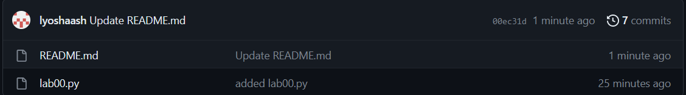
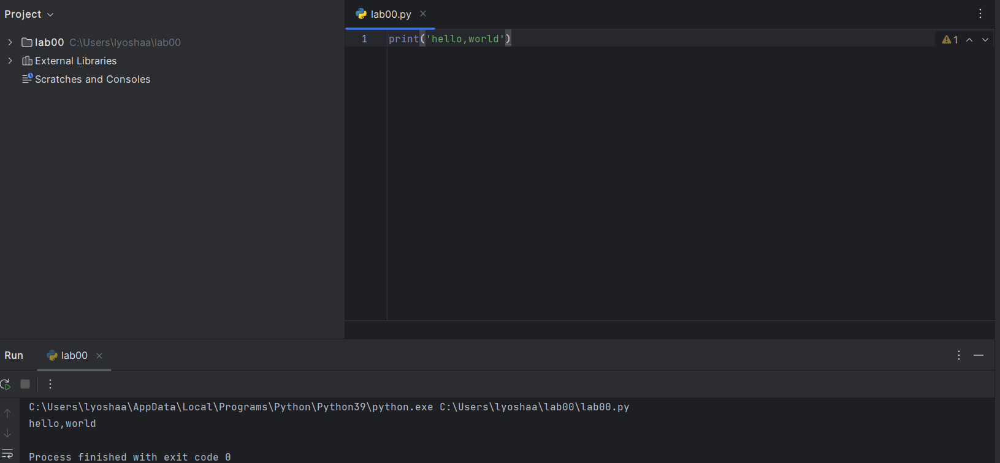

# lab00

_питон-временная загулшка, скоро переделаю все на си_

## Задание

  1.  Создайте репозиторий для дисциплины на GitHub.
  2. Склонируйте его себе на ПК.
  3.  Напишите свою первую программу.
  4. Скомпилируйте и запустите её.
  5.  Получите по отдельности результаты каждого этапа компиляции.
  6.  Напишите отчёт в README.md. Отчёт должен содержать:
       - Задание
       - Описание проделанной работы
       - Консольные команды
       - Скриншоты результатов
       - Ссылки на используемые материалы
  7.  Сделайте коммит и пуш.
  8.  Добавьте для себя в отчёт шпаргалку по работе с git.

## Проделанная работа

После создания проекта на GitHub'е, склонировал его в Git Bash используя `git clone`.  
Затем, создал файл `lab00.py` и добавил в Git с помощью `git add`.  
После написал простейшую прогу в том же `lab00.py`, и закоммитил файл используя `git commit -m "text"`.  
В конце концов заупшил все используя `git push`.  

## Скриншоты

## Список использованных источников

1. [CS50W - Lecture 1 - Git](https://www.youtube.com/watch?v=NcoBAfJ6l2Q)
2. [report_demo](https://github.com/still-coding/report_demo)
3. [Язык разметки Markdown](https://doka.guide/tools/markdown/)
4. [сама лаба](https://evil-teacher.on.fleek.co/prog_pm/lab00/)
