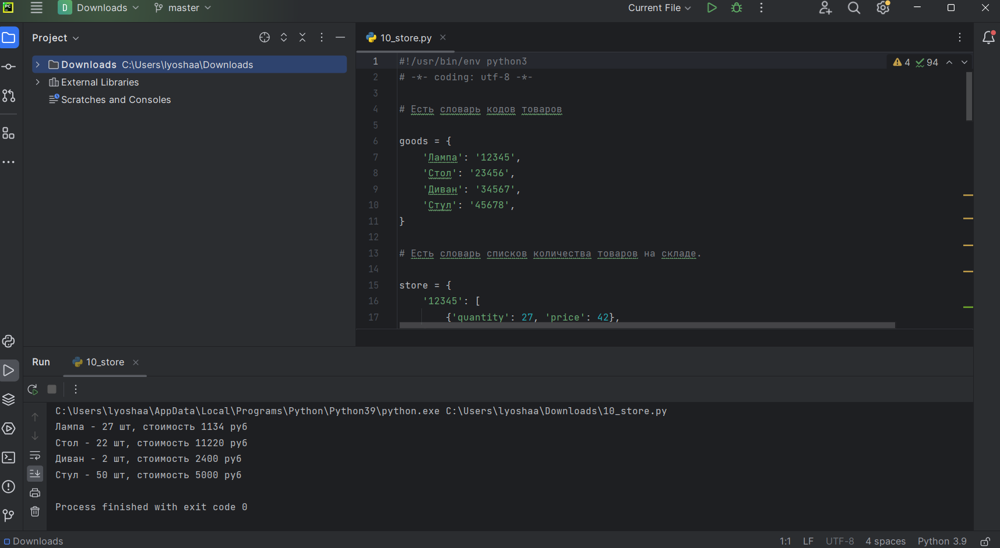

# lab04  

## Задание

    1. Скачайте архив и распакуйте его в свой репозиторий. В нём 11 заданий, которые вам нужно выполнить.  
    2. Оформите отчёт в README.md. По каждому из заданий - описание задачи, скриншот работы программы.  
    
## Проделанная работа

Решил все задания с 0 по 10  
Составил отчет

## Скриншоты

## Список использованных источников

[лаба](https://evil-teacher.on.fleek.co/prog_pm/lab04/)
